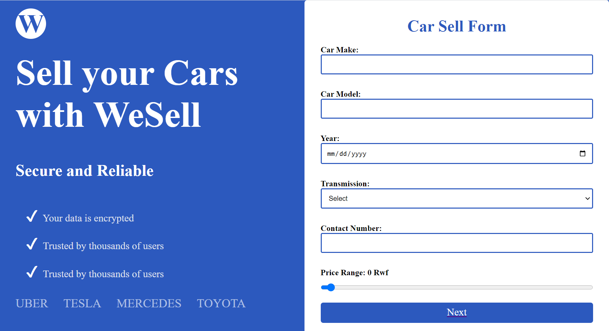

#A complete Car Sell app that does the Folowing Functiiionalities

# Car Make (text input)
# Car Model (text input)
# Year (date picker)
# Mileage (number input)
# Condition (radio button with options: Excellent, Good, Fair, Poor)
# Features (checkboxes with options: Air Conditioning, Power Steering, Power Windows, ABS, Navigation System)
# Transmission (select box with options: Automatic, Manual)
# Price Range (range slider)
# Contact Number (text input)

#How to get started


After getting the starter files, you need to go the file directory and run

```shell
npm install
```

and after that start the dev server.

```shell
npm start
```
